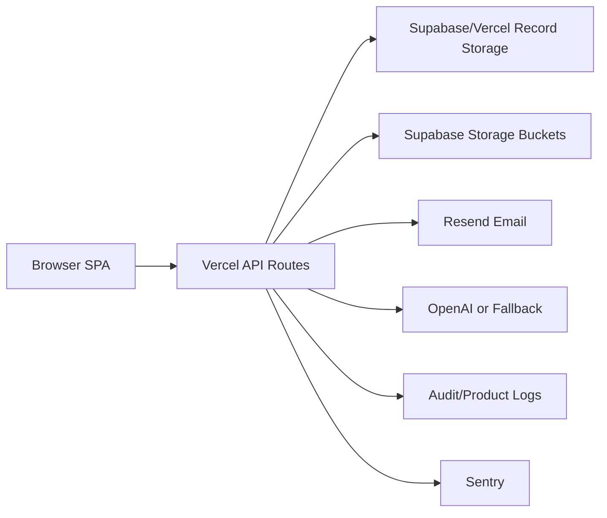

# Architecture Overview

## Runtime

CrossOver Talent runs as a Vercel serverless application:
- `outputs/index.html`, `outputs/styles.css`, and `outputs/app.js` provide the SPA.
- `api/*.js` routes provide backend workflows.
- Supabase or Vercel Blob-backed storage stores JSON records and uploaded files.

## Core Modules

| Module | Responsibility |
|---|---|
| `api/_lib.js` | Storage, sessions, security headers, rate limiting, email, AI, Sentry, file helpers, analytics |
| `api/auth.js` | Employer auth |
| `api/candidate.js` | Candidate auth/profile/saved jobs/preferences |
| `api/company.js` | Employer company profile and logo |
| `api/jobs.js` | Employer job CRUD and public job listing |
| `api/applications.js` | Application submission, employer status updates, candidate withdrawal |
| `api/reviews.js` | Company reviews, edit, delete, moderation |
| `api/salary-signals.js` | Salary signal submission and aggregation |
| `api/assist.js` | File parsing, JD generation, CV revision, LinkedIn URL handling |
| `api/admin.js` | Admin auth, moderation, user management, business dashboard |
| `api/health.js` | Liveness |
| `api/ready.js` | Readiness |

## Auth Model

- Employers, candidates, and admins have separate account record prefixes.
- Email verification blocks dashboard access.
- Sessions are signed HttpOnly cookies.
- Admin actions require admin role.
- Employer actions require employer role and company ID.
- Candidate private actions require candidate role.

## Data Flow

## Launch Architecture Assessment

Strengths:
- Simple operational model.
- Critical workflows covered by Playwright.
- Health/readiness endpoints exist.
- Analytics and audit logs are server-side.
- AI and email have graceful fallbacks.

Constraints:
- Record storage abstraction is not as queryable as fully normalized relational tables.
- Multi-tenant organization/member modeling is not yet formalized.
- SEO is limited by SPA routing.
- Enterprise analytics will need warehousing/export later.

## Recommended Version 1.1 Direction

- Normalize production data into relational Supabase tables.
- Add organization/member/role model.
- Add server-rendered public job/company pages.
- Add entitlement layer for subscriptions.
- Add full observability dashboards.
