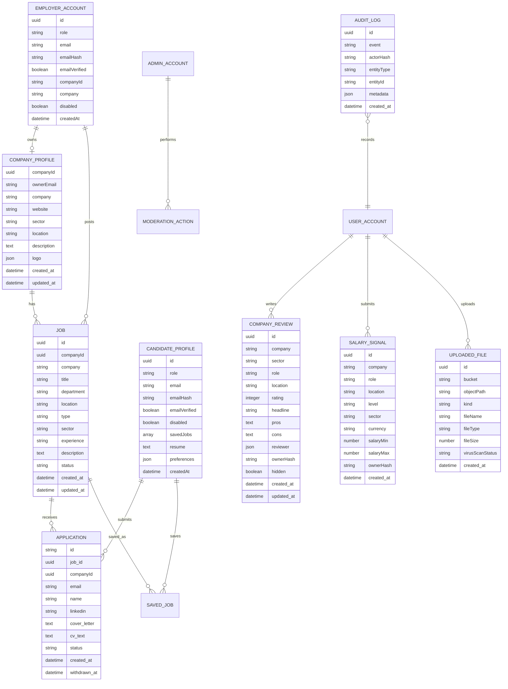

# Database ERD

## Current Logical Model

The app currently stores records through a storage abstraction. The logical entities are:
- Employer accounts
- Candidate profiles
- Admin accounts
- Company profiles
- Jobs
- Applications
- Reviews
- Salary signals
- Uploaded files
- Audit logs
- Rate-limit buckets

## ERD

## Production Recommendation

For Version 1.1, move from JSON-record storage to relational Supabase tables for:
- Search/query performance.
- RLS clarity.
- Reporting and analytics.
- Tenant-level permissions.
- Strong foreign-key enforcement.

Critical indexes:
- Jobs: `status`, `sector`, `location`, `companyId`, `created_at`.
- Applications: `companyId`, `job_id`, `email`, `status`.
- Reviews: `company`, `sector`, `hidden`, `ownerHash`.
- Salary signals: `company`, `role`, `location`, `level`, `sector`.
- Audit logs: `event`, `actorHash`, `created_at`.
