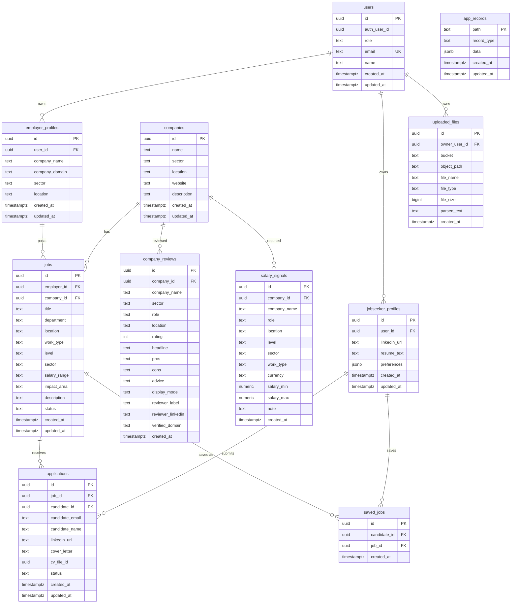

# Supabase Schema Diagram

Date: 2026-07-04

Status: Expected and now production-verified application schema. Production contains these application tables after migration `20260703162517`.

Source: [supabase-staging-schema.sql](/Users/sam/Documents/Codex/2026-06-18/build-me-a-simple-website-where/outputs/supabase-staging-schema.sql)

## Expected Entity Relationship Diagram

## Expected Indexes

- `app_records_path_pattern_idx`
- `app_records_record_type_idx`
- `app_records_data_gin_idx`
- `users_role_idx`
- `jobs_status_sector_location_idx`
- `jobs_search_gin_idx`
- `applications_job_status_idx`
- `reviews_company_sector_idx`
- `salary_company_role_idx`

## Expected RLS

Expected RLS enabled on:

- `app_records`
- `users`
- `employer_profiles`
- `jobseeker_profiles`
- `companies`
- `jobs`
- `applications`
- `saved_jobs`
- `company_reviews`
- `salary_signals`
- `uploaded_files`

Production verification result: app tables exist and RLS is enabled.

Staging verification result: RLS is enabled on the expected app tables.
